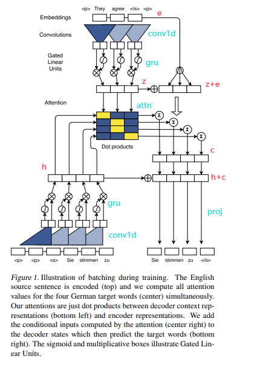
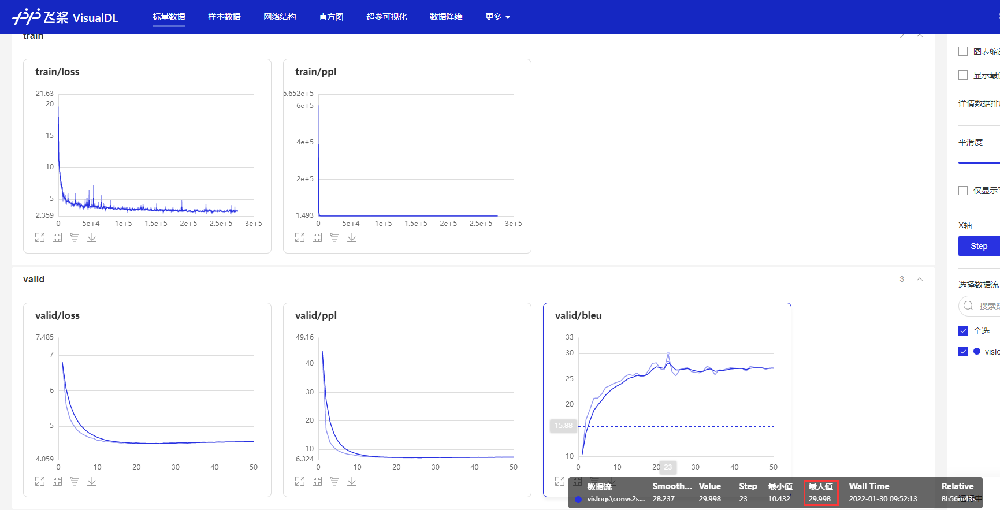

# ConvS2S Paddle论文复现
[Convolutional Sequence to Sequence Learning](https://arxiv.org/abs/1705.03122)

机器翻译（Machine Translation）是利用计算机将一种自然语言(源语言)转换为另一种自然语言(目标语言)的过程，输入为源语言句子，输出为相应的目标语言的句子。

本项目是基于卷积的机器翻译模型ConvS2S的PaddlePaddle 实现，该模型不仅能并行计算，还可以通过层叠的方式捕捉长距离依赖关系。

## 数据准备

公开数据集：WMT 翻译大赛是机器翻译领域最具权威的国际评测大赛，其中英罗马翻译任务提供了一个中等规模的数据集，这个数据集是较多论文中使用的数据集，也是 ConvS2S 论文中用到的一个数据集。本项目使用WMT'16 EN-RO 数据集作为示例提供。		

英罗马数据集共2.86M训练集，1999条测试集。本项目已采用bpe分词处理好，把共现概率最高的字符相连成子词。

en-ro处理脚本：https://github.com/rsennrich/wmt16-scripts/blob/80e21e5/sample/preprocess.sh

backtranslation数据：http://data.statmt.org/rsennrich/wmt16_backtranslations/en-ro 

处理好的wmt16_enro：https://aistudio.baidu.com/aistudio/datasetdetail/126881 

## 模型介绍



- **整体结构：** ConvS2S是经典的encoder、decoder的结构，分别堆叠了多层卷积块。上图中上面的是encoder的结构（嵌入和一个卷积块），最下面是decoder的结构，中间的矩形代表decoder的某层与encoder的输出进行多步注意力，具体为：
  - embed：encoder、decoder分别有个嵌入层，包含词嵌入和位置嵌入，分别得到w和p，将两者相加得到嵌入表示e。
  - conv block：encoder、decoder的卷积块结构相同，基本上都是核为3的一维卷积，通道为输入通道数d的两倍2d，并使用门控线性函数（GLU）将一半通道的输出作为门控，从另一半中抽取需要的时序信息，最终还是得到d维的通道。除此之外，末尾几层通道数会变大，与上一层输出作残差连接时需要用线性层把输入e扩展到相应通道数。
  - multi step attention: 多步注意力即decoder每层输出hi都和encoder输出z做注意力计算，然后用注意力权重抽取encoder的z+e的信息，得到上下文向量c，与当前decoder层的输出hi相加得到hi+c，或者作为decoder下一层输入，或者用proj得到batch*vocab_size的logits，用以表示输出的词
- **模型特点：**
  - 采用卷积结构，复杂度低：n个词，卷积核宽为k，复杂度为O(n/k),而循环神经网络复杂度为O(n)。速度非常快，能够并行训练。
  - 通过堆叠多层卷积，可以扩大感受野，从而捕获长距离的依赖关系，从而用卷积作时序任务。

## 快速开始

### 1.初始准备

```shell
# 克隆至本地
git clone https://github.com/MiuGod0126/ConvS2S_Paddle.git
cd ConvS2S_Paddle
# 安装依赖
pip install -r requirements
# 将数据wmt16_enro和权重文件model_best下载到此处
```

### 2.目录结构

```
├── README.md
├── align.py # 对齐
├── ckpt # 权重
├── config.py #命令行参数 
├── config #配置
│   ├── en2de.yaml #英德
│   └── en2ro.yaml #英罗马
├── data
│   ├── data.py # 数据加载
│   └── sampler.py # 采样器
├── logs # 日志
│   ├── vislogs # 训练曲线 
├── valid.py # 模型验证
├── main.py # 主函数
├── main_multi_gpu.py #多卡训练脚本
├── models #模型文件
├── generate.py # 生成翻译并评估
├── requirements.txt # 依赖
└── wmt16_enro #数据集
```

### 3.模型训练

以提供的英罗马翻译数据为例，可以执行如下命令进行模型训练：

```shell
# 单卡训练
python main.py --config config/en2ro.yaml --mode train
# 多卡训练
python main_multi_gpu.py --cfg configs/en2ro.yaml \
                         --amp \
                         --ngpus 4  \
                         --accum-iter 4 \
                         --max-epoch 100 \
                         --save-epoch 5 \
                         --save-dir /root/paddlejob/workspace/output \
                         --resume ''  \
                         --last-epoch 0 \
                         --log-steps 100 \
                         --max-tokens 4000 \
                         --lr 0.5 \
                         --lr-shrink 0.9 \
                         --patience 1
# 模型验证
python main_multi_gpu.py --cfg configs/en2ro.yaml  --pretrained ./model_best --eval
```

可以在 `config/en2ro.yaml` 件中设置相应的参数,如果要恢复训练需指定恢复的轮数last_epoch，和恢复的权重路径resume，其他参数详见yaml文件。

### 4.预测评估

以英罗马翻译数据为例，模型训练完成后可以执行以下命令对指定文件中的文本进行翻译：

```shell
python generate.py --cfg configs/en2ro.yaml \ # 配置文件
				   --test-pref wmt16_enro_bpe/test \ #测试文件前缀 
				   --pretrained ./model_best \ #权重
				   --beam-size 5 \ # 术搜索宽度
				   --generate-path generate.txt \ # 源文、目标文、预测结果（乱序）
				   --sorted-path result.txt # 翻译结果（顺序）
```

训练、验证曲线使用visualdl生成，命令为：

```shell
visualdl --logdir ./logs/vislogs --port 8080
# 打开链接：localhost:8080
```



在enro数据集上训练了100epoch，目前还没达到原论文水平，相应对比如下：

| Code      | Bleu  |
| --------- | ----- |
| fairseq   | 30.02 |
| this repo | 34.23 |

### 5.相关链接

- enro数据链接：https://aistudio.baidu.com/aistudio/datasetdetail/126881 
- 权重(enro)链接：https://pan.baidu.com/s/1gZGl_KQTgSNV9txE3TQMjQ 提取码：s8np 
- aistudio：https://aistudio.baidu.com/aistudio/projectdetail/2328014

